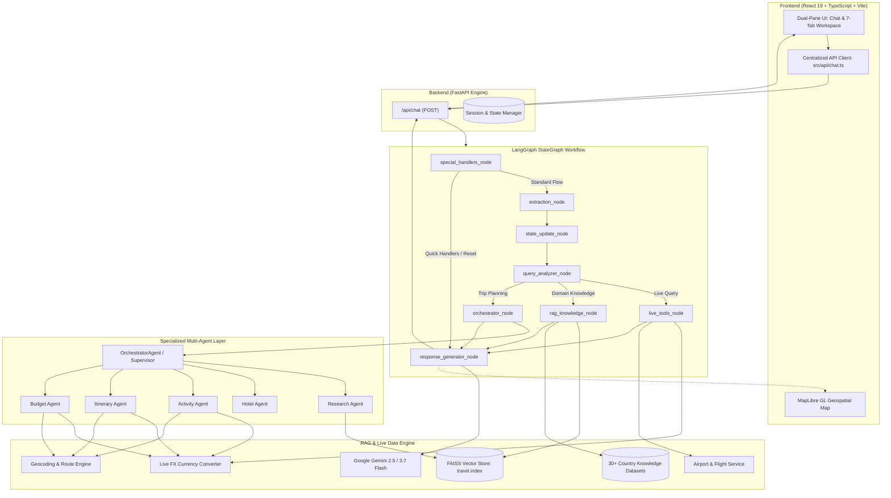
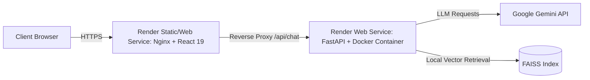

# TravelOS — Autonomous AI Multi-Agent Travel Planning Platform

<div align="center">

[](https://fastapi.tiangolo.com)
[](https://langchain-ai.github.io/langgraph/)
[](https://ai.google.dev/)
[](https://github.com/facebookresearch/faiss)
[](https://react.dev/)
[](https://www.typescriptlang.org/)
[](https://maplibre.org/)
[](https://www.docker.com/)

<br/>

**An intelligent, multi-agent travel orchestration engine that turns conversational travel goals into fully customized, cost-optimized, and geospatially mapped itineraries in seconds.**

[🚀 Live Web Application](https://travelos-1.onrender.com) • [⚡ API Server](https://travelos-ncn1.onrender.com) • [📖 Backend Docs](backend/README.md) • [💻 Frontend Docs](frontend/README.md)

</div>

---

## 🌟 Overview

Planning an international trip often requires juggling dozens of disconnected browser tabs: comparing flights, filtering hotels, searching for activities, balancing a strict budget across currencies, and plotting routes on maps.

**TravelOS** replaces this fragmented process with an **autonomous multi-agent system** orchestrated by **LangGraph** and powered by **Google Gemini** and **FAISS Vector RAG**. Through natural conversation, TravelOS automatically extracts travel constraints, resolves global currencies and airport codes, routes sub-tasks to specialized domain agents, calculates real-time expense allocations, and projects every point of interest onto an interactive 3D map.

### 🌐 Live Deployments
- **Frontend App:** [https://travelos-1.onrender.com](https://travelos-1.onrender.com)
- **Backend API:** [https://travelos-ncn1.onrender.com](https://travelos-ncn1.onrender.com)

---

## 📸 Product Showcase

The following walkthrough demonstrates the end-to-end user workflow in TravelOS:

### 1. Conversational Onboarding & Live Intent Extraction
Chat naturally with TravelOS. The extraction node automatically identifies destination, trip length, passenger count, budget constraints, and personal interests in real time, displaying live metadata chips above the chat.


---

### 2. Multi-Agent Synthesis & Origin-Destination Route Mapping
Once travel parameters are confirmed, the Orchestrator synthesizes the plan and triggers origin-to-destination flight corridor mapping.


---

### 3. AI-Generated Day-by-Day Smart Itinerary
The **Itinerary Agent** constructs a synchronized schedule structured into Morning, Afternoon, and Evening slots, complete with local meal recommendations, transit advice, and daily cost estimates.


---

### 4. Curated Experiences & Live Swapping Engine
The **Activity Agent** recommends attractions tailored to traveler interests and budget thresholds. Users can filter by budget tier or instantly request alternate activities via one-click replacement triggers.


---

### 5. Live Flight Intelligence & Ranking
The **Flight Service & Ranker** scans origin-to-destination routes, providing direct vs. layover comparisons, durations, and real-time localized price conversions.


---

### 6. Accommodation & Hotel Intelligence
The **Hotel Agent** matches properties based on destination proximity, star rating, verified amenities, and price tier, updating total accommodation costs directly in the active budget.


---

### 7. Dynamic Multi-Currency Budget Intelligence
The **Budget Agent** tracks total estimated spend against your target budget, calculating per-day and per-traveler metrics with automatic category breakdowns across flights, accommodations, dining, activities, and transport.


---

### 8. Geospatial Intelligence & Interactive Map
Powered by **MapLibre GL**, every hotel, sight, and route is mapped with interactive pins, 3D camera controls, and category filtering.


---

### 9. Context-Aware POI Deep Dive ("Ask TravelOS About This")
Clicking any point of interest on the interactive map allows users to query TravelOS directly about that specific location for instant historical, cultural, or logistical advice.


---

## 🧠 System Architecture

TravelOS uses a stateful **LangGraph `StateGraph`** pipeline where user requests transition through structured nodes for intent classification, RAG retrieval, live lookups, multi-agent coordination, and natural language response synthesis.



---

## 🤖 Multi-Agent Collaboration

| Agent | Responsibility | Core Inputs | Primary Outputs |
| :--- | :--- | :--- | :--- |
| **`OrchestratorAgent`** *(Supervisor)* | Central coordination, task delegation, status tracking, and unified map layer assembly. | User message, `TravelState`, query intent, live tool responses. | Consolidated trip plan payload, map markers, synchronized state. |
| **`ResearchAgent`** | Domain knowledge retrieval covering local culture, hidden gems, visa requirements, best seasons, and safety. | Destination name, user inquiry topic. | Verified domain context backed by FAISS vector knowledge documents. |
| **`HotelAgent`** | Curating and ranking accommodations based on traveler preferences, location center proximity, and budget. | Destination, budget level, traveler count, night count. | Ranked hotel options, nightly rates, amenities list, coordinates. |
| **`ActivityAgent`** | Curating category-tagged attractions (Sightseeing, Food, Adventure, Culture) and handling live activity swaps. | Destination, traveler interests, budget category, duration. | Day-mapped experiences, price estimates, alternate swap candidates. |
| **`ItineraryAgent`** | Generating synchronized day-by-day itineraries with structured morning, afternoon, and evening timelines. | Destination, duration, traveler profile, curated activities. | Structured daily schedules, meal suggestions, local transit tips. |
| **`BudgetAgent`** | Managing multi-currency financial allocations across 5 core categories with real-time FX conversions. | Target budget, currency, passenger count, flight/hotel/activity costs. | Categorized spend breakdown, daily averages, budget surplus/deficit status. |

---

## ⚡ Core Features

- **🗣️ Conversational Trip Parsing:** Extracts entity constraints (origin, destination, dates, duration, budget, currency, interests) using structured LLM schemas.
- **🗺️ Interactive MapLibre GL Visualization:** Renders 3D terrain, custom POI markers, route arcs, and responsive popovers.
- **🔄 Dynamic Activity Swapping:** Allows one-click replacement of any planned activity while maintaining schedule and budget coherence.
- **💱 Multi-Currency FX Engine:** Automatically converts local destination expenses into the traveler's home currency.
- **📚 Domain-Specific Vector RAG:** FAISS vector store indexing 30+ curated country guides with chunked embeddings for accurate travel intelligence.
- **📊 Real-Time Budget Breakdown:** Visualizes budget distribution across flights, lodging, food, attractions, and transit.
- **🛡️ Resilient LLM Fallback Pipeline:** Cascading model routing (`gemini-flash-latest` → `gemini-flash-lite-latest` → `gemini-3.7-flash`) prevents transient API failures.

---

## 🛠️ Technology Stack

### Frontend
- **Framework:** [React 19](https://react.dev/) + [TypeScript](https://www.typescriptlang.org/)
- **Build Tool:** [Vite 8](https://vitejs.dev/)
- **Mapping:** [MapLibre GL](https://maplibre.org/)
- **Animations:** [Framer Motion](https://www.framer.com/motion/)
- **Icons:** [Lucide React](https://lucide.dev/)
- **Production Server:** [Nginx Alpine](https://www.nginx.com/)

### Backend
- **Framework:** [FastAPI](https://fastapi.tiangolo.com/) + [Uvicorn](https://www.uvicorn.org/)
- **Orchestration:** [LangGraph](https://langchain-ai.github.io/langgraph/) (`StateGraph`)
- **LLM Engine:** [Google Gemini API](https://ai.google.dev/) (`google-genai` SDK)
- **Vector Search & RAG:** [FAISS (faiss-cpu)](https://github.com/facebookresearch/faiss)
- **Data Validation:** [Pydantic v2](https://docs.pydantic.dev/)
- **HTTP Client:** [HTTPX](https://www.python-httpx.org/)

### Infrastructure & Deployment
- **Containerization:** Multi-stage [Docker](https://www.docker.com/) & Docker Compose
- **Cloud Platform:** [Render](https://render.com/) (Web Services + Static / Nginx containers)

---

## 📁 Repository Structure

```text
TravelOS/
├── README.md                          # Main project documentation
├── docker-compose.yml                 # Local full-stack container orchestration
│
├── backend/                           # FastAPI + LangGraph Backend
│   ├── README.md                      # Backend technical documentation
│   ├── Dockerfile                     # Backend container specification
│   ├── requirements.txt               # Python package dependencies
│   ├── run.py                         # Local entrypoint runner
│   ├── .env.example                   # Backend environment template
│   ├── app/
│   │   ├── main.py                    # FastAPI application & CORS configuration
│   │   ├── config.py                  # Environment variable loader
│   │   ├── api/routes/chat.py         # Primary /api/chat & health endpoints
│   │   ├── graph/                     # LangGraph StateGraph nodes, edges, state
│   │   │   ├── graph.py               # Graph compilation & execution service
│   │   │   ├── nodes.py               # Graph execution node implementations
│   │   │   ├── edges.py               # Conditional routing logic
│   │   │   └── state.py               # AgentGraphState TypedDict definition
│   │   ├── agents/                    # Specialized AI Domain Agents
│   │   │   ├── supervisor.py          # OrchestratorAgent coordinator
│   │   │   ├── research_agent.py      # RAG knowledge retrieval agent
│   │   │   ├── hotel_agent.py         # Accommodation curation agent
│   │   │   ├── activity_agent.py      # Experience & swap recommendation agent
│   │   │   ├── itinerary_agent.py     # Day-by-day schedule generation agent
│   │   │   └── budget_agent.py        # Multi-currency cost allocation agent
│   │   ├── rag/                       # FAISS RAG & vector retrieval pipeline
│   │   │   ├── vector_store.py        # FAISS index loader & similarity search
│   │   │   ├── rag_services.py        # Domain retrieval & query builder
│   │   │   ├── query_analyzer.py      # Intent classification & routing
│   │   │   └── dataset_loader.py      # Travel knowledge document ingestion
│   │   ├── services/                  # Business logic & external services
│   │   │   ├── llm_service.py         # Google Gemini client with model fallback
│   │   │   ├── live_query_service.py  # Live weather, currency, and flight router
│   │   │   ├── currency_services.py   # FX exchange rate calculations
│   │   │   ├── airport_service.py     # Global IATA airport code resolver
│   │   │   ├── flight_service.py      # Flight search & price estimator
│   │   │   ├── hotel_service.py       # Hotel catalog & distance resolver
│   │   │   └── session_manager.py     # In-memory conversation state store
│   │   └── models/                    # Pydantic schemas & state models
│   ├── data/
│   │   ├── travel_knowledge/          # Curated country guides (30+ JSONs)
│   │   └── vector_store/              # Precomputed FAISS index (travel.index)
│   └── images/                        # Application UI screenshots (9 files)
│
└── frontend/                          # React 19 + Vite Frontend
    ├── README.md                      # Frontend architecture documentation
    ├── Dockerfile                     # Multi-stage build + Nginx configuration
    ├── nginx.conf                     # Production reverse proxy config
    ├── package.json                   # Dependencies & scripts
    ├── vite.config.ts                 # Vite bundler config
    └── src/
        ├── App.tsx                    # Main layout & state orchestrator
        ├── api/chat.ts                # Centralized backend API client
        ├── components/
        │   ├── Chat/                  # Chat stream, input bar, message bubbles
        │   ├── Map/                   # MapLibre GL interactive map & 3D canvas
        │   ├── trip/                  # Itinerary timeline & Day-by-Day schedule
        │   ├── activities/            # Activity cards & swap controls
        │   ├── hotels/                # Hotel accommodation cards & links
        │   ├── flights/               # Flight search cards & comparisons
        │   ├── budget/                # Budget allocation charts & metrics
        │   └── weather/               # Live destination weather widgets
        └── types/                     # Shared TypeScript interfaces
```

---

## 🚀 Quick Start & Local Setup

### Prerequisites
- **Python:** 3.11+
- **Node.js:** 18+ (or npm 9+)
- **Google Gemini API Key:** [Get an API Key](https://aistudio.google.com/)

---

### Option 1: Running with Docker Compose (Recommended)

1. Clone the repository:
   ```bash
   git clone https://github.com/PiyushRaj472100/TravelOS.git
   cd TravelOS
   ```

2. Configure environment variables in `backend/.env`:
   ```bash
   cp backend/.env.example backend/.env
   ```
   Add your Google Gemini API key:
   ```env
   GEMINI_API_KEY=your_gemini_api_key_here
   ```

3. Build and start containers:
   ```bash
   docker-compose up --build
   ```

4. Access the application:
   - **Frontend UI:** `http://localhost:3000`
   - **Backend API:** `http://localhost:8000`

---

### Option 2: Running Locally from Source

#### 1. Backend Setup
```bash
cd backend

# Create and activate virtual environment
python -m venv venv

# Windows:
.\venv\Scripts\activate
# macOS/Linux:
source venv/bin/activate

# Install dependencies
pip install -r requirements.txt

# Create .env and set GEMINI_API_KEY
cp .env.example .env

# Run FastAPI dev server
python run.py
# Server runs on http://localhost:8000
```

#### 2. Frontend Setup
```bash
cd frontend

# Install Node dependencies
npm install

# Start Vite development server
npm run dev
# App runs on http://localhost:5173
```

---

## ⚙️ Environment Variables

### Backend (`backend/.env`)
| Variable | Description | Required | Default |
| :--- | :--- | :---: | :--- |
| `GEMINI_API_KEY` | Google Gemini API key for LLM generation & structured extraction | **Yes** | — |
| `ENVIRONMENT` | Runtime environment mode | No | `development` |
| `DEBUG` | Enable debug logs | No | `true` |
| `PORT` | Backend server port | No | `8000` |

### Frontend (`frontend/.env`)
| Variable | Description | Required | Default |
| :--- | :--- | :---: | :--- |
| `VITE_API_URL` | Backend base URL (leave empty for same-origin proxy) | No | `http://localhost:8000` |

---

## 🚢 Deployment Architecture

TravelOS is configured for automated cloud deployment on [Render](https://render.com):



- **Frontend Container:** Multi-stage build running `npm run build` with static assets served via an optimized `nginx:alpine` image with SPA routing fallbacks.
- **Backend Container:** Lightweight `python:3.11-slim` container installing non-cacheable wheels, bundling precomputed vector indices, and serving with Uvicorn.

---

## 📄 License

Distributed under the **MIT License**. See `LICENSE` for more information.

---

<div align="center">
Built with ❤️ for intelligent, seamless travel planning.
</div>
