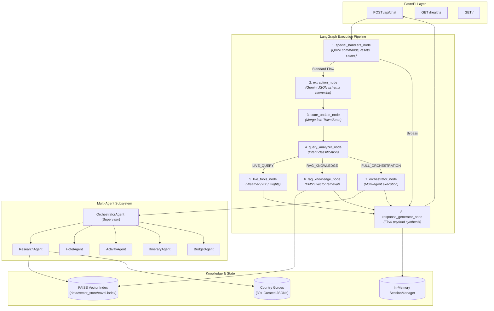

# TravelOS — Backend Architecture & Multi-Agent Engine

<div align="center">

[](https://www.python.org/)
[](https://fastapi.tiangolo.com)
[](https://langchain-ai.github.io/langgraph/)
[](https://ai.google.dev/)
[](https://github.com/facebookresearch/faiss)
[](https://docs.pydantic.dev/)

<br/>

**Production-grade FastAPI backend powering TravelOS with LangGraph multi-agent orchestration, FAISS vector retrieval, live data synthesis, and structured conversational intelligence.**

[🚀 API Base](https://travelos-ncn1.onrender.com) • [💻 Root Documentation](../README.md) • [🌐 Frontend Documentation](../frontend/README.md)

</div>

---

## 🏗️ Architecture Overview

The TravelOS backend is designed as an asynchronous, stateful orchestration pipeline. Instead of relying on a monolithic prompt, it divides travel planning into modular nodes and specialized domain agents coordinated through **LangGraph**.



---

## 🤖 The Multi-Agent System

```
                        ┌──────────────────────────────┐
                        │   OrchestratorAgent (Supervisor) │
                        └──────────────┬───────────────┘
          ┌──────────────┬─────────────┼──────────────┬──────────────┐
          ▼              ▼             ▼              ▼              ▼
   ┌─────────────┐ ┌───────────┐ ┌───────────┐ ┌─────────────┐ ┌───────────┐
   │ Research    │ │ Hotel     │ │ Activity  │ │ Itinerary   │ │ Budget    │
   │ Agent       │ │ Agent     │ │ Agent     │ │ Agent       │ │ Agent     │
   └─────────────┘ └───────────┘ └───────────┘ └─────────────┘ └───────────┘
```

### 1. `OrchestratorAgent` (`app/agents/supervisor.py`)
- **Role:** Master coordinator that evaluates user intent against the active `TravelState` and delegates sub-tasks to domain agents.
- **Key Responsibilities:**
  - Manages agent lifecycles (`idle` → `running` → `completed`).
  - Aggregates outputs from all specialized agents into a unified frontend payload.
  - Assembles unified `MapData` (destination pins, airport markers, hotel locations, attraction coordinates, and origin-to-destination flight routes).

### 2. `ResearchAgent` (`app/agents/research_agent.py`)
- **Role:** Deep domain specialist for destination knowledge.
- **Key Responsibilities:**
  - Interfaces with `RAGService` to retrieve relevant chunks from the FAISS vector index.
  - Synthesizes cultural tips, best neighborhoods, local transit advisories, safety precautions, and seasonal highlights.

### 3. `HotelAgent` (`app/agents/hotel_agent.py`)
- **Role:** Accommodation search and ranking specialist.
- **Key Responsibilities:**
  - Filters curated accommodations by destination, budget tier, traveler count, and duration.
  - Computes distance to city center, verifies amenities (Wi-Fi, breakfast, accessibility), and calculates estimated nightly and total accommodation costs.

### 4. `ActivityAgent` (`app/agents/activity_agent.py`)
- **Role:** Experience curation and dynamic replacement engine.
- **Key Responsibilities:**
  - Matches attractions to traveler interest tags (`Culture`, `Adventure`, `Food`, `Sightseeing`, `Entertainment`).
  - Implements dynamic activity swapping: when a user clicks "Give another option", it replaces the target experience while preserving schedule balance.

### 5. `ItineraryAgent` (`app/agents/itinerary_agent.py`)
- **Role:** Temporal schedule architect.
- **Key Responsibilities:**
  - Organizes curated activities into a day-by-day itinerary structured into Morning (`10:00`), Afternoon (`14:00`), and Evening (`18:30`) blocks.
  - Suggests local breakfast, lunch, and dinner options paired with actionable transit tips (e.g., transit cards, rail passes).

### 6. `BudgetAgent` (`app/agents/budget_agent.py`)
- **Role:** Financial allocation and multi-currency calculation engine.
- **Key Responsibilities:**
  - Distributes total budget across 5 core expense categories: Flights, Hotels, Food & Dining, Activities & Attractions, and Local Transport.
  - Integrates `CurrencyService` to compute real-time FX conversions between local destination currency and the traveler's home currency.
  - Calculates daily burn rate (`avg_per_day`) and per-passenger cost (`avg_per_person`), alerting when a plan is over or under budget.

---

## 🔍 Vector RAG & Knowledge Retrieval

TravelOS features a custom retrieval-augmented generation (RAG) architecture built with **FAISS**:

```text
Travel Knowledge JSONs (30+ Countries)
                 │
                 ▼
      [Document Loader & Chunker]
                 │
                 ▼
         [Embedding Service]
                 │
                 ▼
  FAISS Vector Index (travel.index) + Metadata Store (metadata.json)
                 │
                 ▼
  [Cosine Similarity Search & Context Builder]
                 │
                 ▼
         [ResearchAgent & LLM]
```

- **Knowledge Base:** 30+ structured country guides located in `data/travel_knowledge/` covering visa rules, top sights, safety guidelines, and culinary specialties.
- **Vector Store:** Precomputed FAISS L2/Cosine index (`data/vector_store/travel.index`) paired with `metadata.json` for low-latency sub-millisecond retrieval.
- **Query Analyzer:** `QueryAnalyzer` classifies queries into knowledge questions, live tool queries, or full trip planning workflows.

---

## ⚡ Fallback & Resilient LLM Service

The `LLMService` (`app/services/llm_service.py`) uses a cascading fallback architecture to prevent API rate limits or service interruptions:

```python
MODELS = [
    "gemini-flash-latest",
    "gemini-flash-lite-latest",
    "gemini-3.7-flash",
]
```

If the primary model experiences a timeout or transient error, `LLMService` automatically falls back to secondary models without breaking the user session.

---

## 📡 API Reference

### 1. `POST /api/chat`
The primary conversational endpoint for interacting with the LangGraph multi-agent pipeline.

#### Request Body
```json
{
  "message": "I want to go to Japan with my wife for 7 days with a budget of 700000 INR from Delhi",
  "session_id": "optional-uuid4-string"
}
```

#### Response Body
```json
{
  "message": "Your complete personalised itinerary for Japan is ready!...",
  "session_id": "a71573d0-a684-491e-9f1f-14a0d1e8e372",
  "travel_state": {
    "destination": "Japan",
    "origin": "Delhi",
    "duration_days": 7,
    "travelers": 2,
    "budget": 700000.0,
    "currency": "INR",
    "interests": ["Adventures", "Sightseeing"]
  },
  "agent_statuses": [
    { "agent": "research_agent", "status": "completed" },
    { "agent": "hotel_agent", "status": "completed" },
    { "agent": "activity_agent", "status": "completed" },
    { "agent": "itinerary_agent", "status": "completed" },
    { "agent": "budget_agent", "status": "completed" }
  ],
  "itinerary": [ ... ],
  "hotels": [ ... ],
  "flights": [ ... ],
  "activities": [ ... ],
  "budget": {
    "target_budget": 700000.0,
    "estimated_total": 677067.0,
    "currency": "INR",
    "remaining_budget": 22933.0,
    "is_over_budget": false,
    "categories": {
      "flights": { "amount": 219851.0, "percentage": 32.5 },
      "hotels": { "amount": 216793.0, "percentage": 32.0 },
      "food_dining": { "amount": 93676.0, "percentage": 13.8 },
      "activities": { "amount": 106600.0, "percentage": 15.7 },
      "local_transport": { "amount": 40147.0, "percentage": 5.9 }
    },
    "metrics": {
      "avg_per_day": 96724.0,
      "avg_per_person": 338534.0
    }
  },
  "map_data": {
    "center": [139.6917, 35.6895],
    "zoom": 11,
    "markers": [ ... ],
    "routes": [ ... ]
  }
}
```

### 2. `GET /healthz`
Health-check endpoint used by container orchestrators and the frontend connection monitor.
```json
{
  "status": "ok"
}
```

### 3. `GET /`
Service root returning runtime status and API version.
```json
{
  "message": "Welcome to the TravelOS API!",
  "status": "running",
  "version": "1.0.0"
}
```

---

## 🛠️ Local Development Setup

### 1. Prerequisites
- Python 3.11+
- Google Gemini API Key

### 2. Setup Virtual Environment
```bash
cd backend

# Create virtual environment
python -m venv venv

# Activate virtual environment
# Windows:
.\venv\Scripts\activate
# macOS / Linux:
source venv/bin/activate

# Install dependencies
pip install -r requirements.txt
```

### 3. Configure Environment Variables
Copy `.env.example` to `.env`:
```bash
cp .env.example .env
```
Populate `.env`:
```env
GEMINI_API_KEY=your_google_gemini_api_key
ENVIRONMENT=development
DEBUG=true
PORT=8000
```

### 4. Start Development Server
```bash
python run.py
```
*The server will start on `http://localhost:8000` with hot reloading enabled.*

---

## 🐳 Docker Deployment

Build and run the backend container locally:

```bash
docker build -t travelos-backend .
docker run -p 8000:8000 --env-file .env travelos-backend
```

The container runs `python:3.11-slim` with optimized layer caching and an internal healthcheck against `/healthz`.
