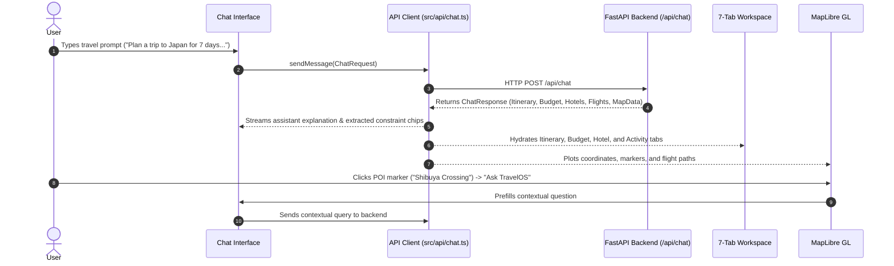

# TravelOS — Frontend Client & Interactive Workspace

<div align="center">

[](https://react.dev/)
[](https://www.typescriptlang.org/)
[](https://vitejs.dev/)
[](https://maplibre.org/)
[](https://www.framer.com/motion/)
[](https://www.nginx.com/)

<br/>

**Modern, responsive, glassmorphic travel command center featuring real-time conversational AI, interactive 3D map visualization, dynamic itinerary scheduling, and live budget tracking.**

[🚀 Live Application](https://travelos-1.onrender.com) • [💻 Root Documentation](../README.md) • [⚡ Backend Documentation](../backend/README.md)

</div>

---

## 🎨 UI & Workspace Architecture

The TravelOS frontend is engineered around a **dual-pane reactive workspace** that seamlessly bridges natural language conversation with structured graphical travel intelligence.

```
┌────────────────────────────────────────────────────────────────────────────────────────┐
│  🌍 TravelOS (Header: Active Session, Multi-Agent Status Indicator, New Trip Button)   │
├───────────────────────────────────┬────────────────────────────────────────────────────┤
│  LEFT PANE: Conversational Chat   │  RIGHT PANE: Interactive 7-Tab Workspace           │
│                                   │                                                    │
│  • Extracted Constraints Bar      │  [ 🗺️ Map ] [ 📅 Itinerary ] [ 🏨 Hotels ]        │
│    (Destination, Days, Budget)    │  [ ✈️ Flights ] [ ⚡ Activities ] [ 💰 Budget ]   │
│                                   │  [ ⛅ Weather ]                                    │
│  • Reactive Message Stream        │                                                    │
│  • Suggested Follow-up Prompts    │  • Geospatial POI Markers & 3D Route Lines         │
│  • Interactive Quick Action Chips │  • Day-by-Day Morning/Afternoon/Evening Schedule   │
│  • Contextual Map Trigger Input   │  • Filterable Activities with Dynamic Swap Actions │
│                                   │  • Multi-Currency Expense Allocation Charts        │
└───────────────────────────────────┴────────────────────────────────────────────────────┘
```

---

## 🗺️ Geospatial Intelligence (MapLibre GL)

The map engine (`src/components/Map/`) is built on **MapLibre GL** and delivers high-performance vector rendering:

- **Custom Interactive Markers:** Renders custom pins for destinations, airports, accommodations, and categorized sights.
- **Flight & Transit Corridors:** Draws curved geodesic route paths connecting origins to destinations.
- **Contextual POI Deep Dive:** Clicking any pin opens a localized action card featuring the **"✨ Ask TravelOS about this"** button, allowing travelers to interrogate the AI about specific monuments, districts, or venues.
- **Layer Controls:** One-click toggles for 3D terrain pitch, bounding-box auto-fitting (`Fit`), and dark/light base map styles.

---

## 🧩 Component Hierarchy

```text
src/
├── App.tsx                    # Root state coordinator & layout wrapper
├── main.tsx                   # React 19 entry point & DOM mounting
├── index.css                  # Global design tokens, dark theme & scrollbars
├── App.css                    # Grid layout & responsive pane styling
│
├── api/
│   └── chat.ts                # Centralized backend HTTP client (Fetch API)
│
├── components/
│   ├── Layout/                # Top navbar, session badges, connection indicator
│   ├── Chat/                  # Chat message list, typing indicators, input bar
│   ├── Map/                   # MapLibre GL canvas, custom markers, popups, route arcs
│   ├── trip/                  # Itinerary timeline view, day accordions, meal cards
│   ├── activities/            # Filterable activity cards, budget tags, swap triggers
│   ├── hotels/                # Hotel accommodation cards, rating stars, distance badges
│   ├── flights/               # Flight options, duration metrics, nonstop badges
│   ├── budget/                # Target vs estimated spend, progress bars, FX rates
│   ├── weather/               # Forecast cards and temperature widgets
│   └── common/                # Reusable buttons, badges, loaders, modals
│
└── types/
    └── index.ts               # Shared TypeScript schemas (Chat, Itinerary, Budget, State)
```

---

## 🔄 State Flow & Agent Synchronization



---

## 💅 Styling & Design System

TravelOS uses a bespoke **Vanilla CSS design system** (`src/index.css`) optimized for high-performance rendering:
- **Glassmorphism:** Frosted translucent overlays with `backdrop-filter: blur(12px)`.
- **Dark Mode Palette:** Modern slate backgrounds (`#0B0F19`), neon accents (`#6366F1`, `#EC4899`, `#10B981`), and muted borders.
- **Framer Motion Micro-Interactions:** Smooth page transitions, tab switching fades, and accordion expansions.

---

## 🛠️ Local Development Setup

### 1. Prerequisites
- **Node.js:** 18.0+
- **npm:** 9.0+

### 2. Installation
```bash
cd frontend
npm install
```

### 3. Environment Configuration
Create a `.env` file in the `frontend` root:
```env
# URL of your running TravelOS backend
VITE_API_URL=http://localhost:8000
```
*(Note: If running with Docker or Nginx reverse proxy, leave this empty to use same-origin `/api/chat`).*

### 4. Development Server
```bash
npm run dev
```
The app will be available at `http://localhost:5173`.

### 5. Production Build & Linting
```bash
# Typecheck and build static bundle
npm run build

# Run fast code linting via oxlint
npm run lint

# Preview production build locally
npm run preview
```

---

## 🐳 Docker & Nginx Production Setup

The frontend is containerized using a multi-stage Docker build:

1. **Stage 1 (Builder):** Uses `node:20-alpine` to install dependencies and execute `npm run build`.
2. **Stage 2 (Server):** Uses lightweight `nginx:alpine` to serve compiled static assets with SPA fallback routing and proxying configured in `nginx.conf`.

```bash
docker build -t travelos-frontend .
docker run -p 3000:80 travelos-frontend
```

Accessible at `http://localhost:3000`.
